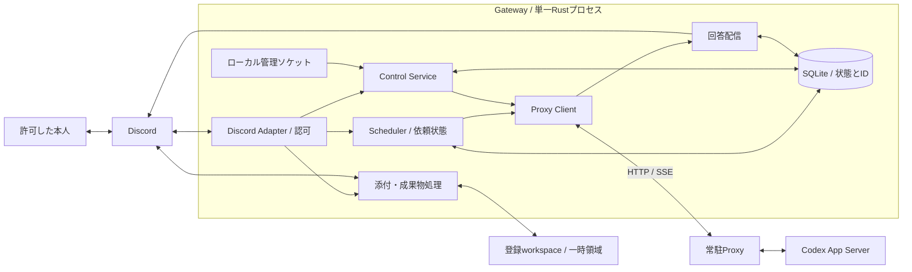
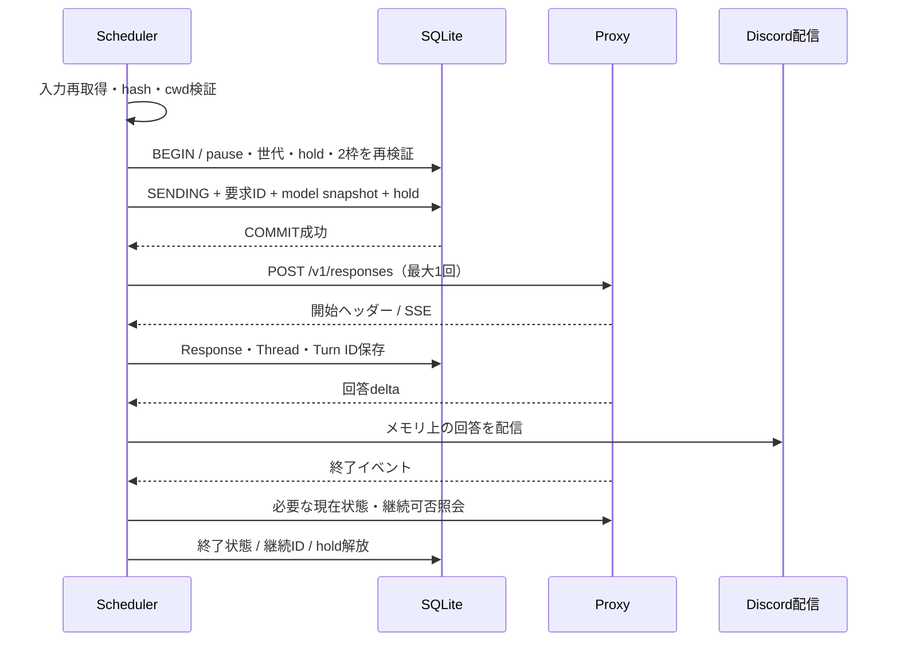
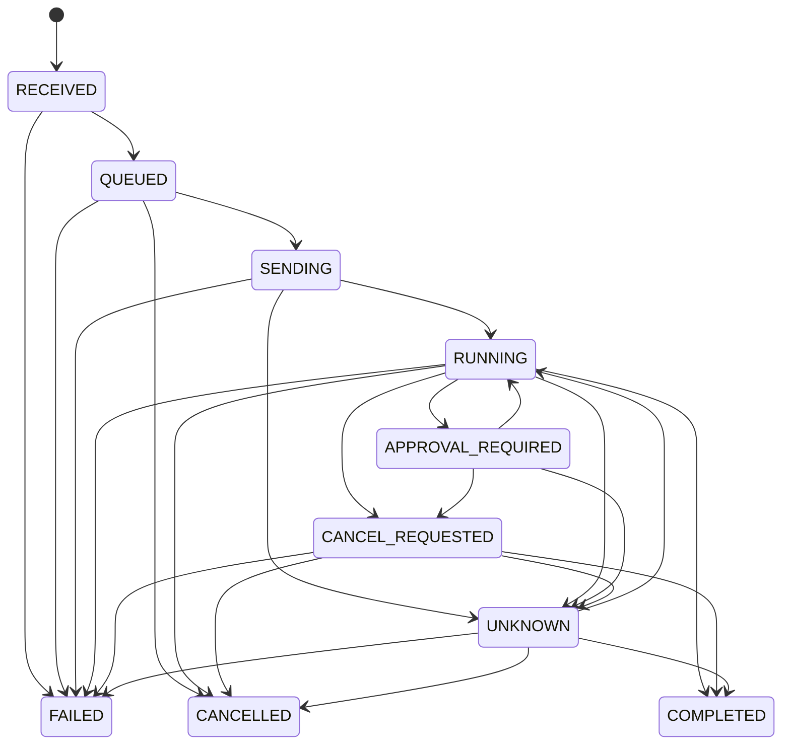

# Codex Hoshikage Gateway システム設計書

作成日: 2026-09-11  
版: 0.3（要件0.7・Proxy制御API契約1.0／最終レビュー5件の補完反映）  
著作者・著作権者: Tane Channel Technology  
配布ライセンス: MIT

## 1. 位置づけと設計の結論

本書は[要件定義書0.7](requirements.ja.md)を実装可能な構成・処理・データへ具体化する。利用者、会話構成、Rust、SQLite、Steer、モデル変更、添付、全体2並列等の決定事項は変更しない。Proxyとの外部契約は[制御API契約1.0](../../codex-hoshikage-proxy/docs/control-api.ja.md)を基準とする。

Gatewayは単一Rustプロセスとして動作し、Discord接続、受付・認可、会話と依頼の管理、待ち行列、Proxy制御、回答配信を担当する。SQLiteを状態の正本とし、本文・回答を永続保存しない。App ServerはProxyが所有する。Proxy内部crateへの依存、App Serverへの直接接続、GatewayによるProxyサービスの起動・停止は行わない。

本書の処理規則は実装方針であり、動作検証済みの実装を示すものではない。数値は「確定要件」「設計初期値」「導入時の必須設定」を区別する。特に添付容量・件数・保存期間へ仮の数値を既定値として埋め込まない。残る検証項目は第17節に集約し、合意済みの利用方針を再質問しない。

[設計レビュー](system-design-review.ja.md)のR-01〜R-08を反映した。対策は本書の状態・データ・操作・試験へ組み込み、Proxy契約の追加拡張は前提にしない。設計反映済みと実装検証済みを区別する。さらに最終指摘FNL-01〜FNL-05（タスク監視、migration、正式バックアップ、reload分類、検証予約回収）を反映し、設計レビューを完了とする。実装・結合試験の未実施項目は受入試験へ引き継ぐ。

## 2. 全体構成と責務



| 境界 | Gatewayの責務 | Proxyの責務 |
| --- | --- | --- |
| 本人確認 | User/Guild/Channel/Thread照合、操作ごとの認可 | Bearer認証、共有管理主体 |
| 実行 | 2並列、会話・workspace排他、入力組立、送信最大1回 | Codex実行、要求記録、Turn識別、同一Thread競合拒否 |
| 制御 | 対象固定、ボタン、操作重複防止、結果表示 | 承認・Interrupt・Steer・現在状態API |
| 保存 | Discord対応ID、状態、hash、pause、監査 | 汎用要求・Turn記録、成功Responseの継続情報 |
| ファイル | Discord添付取得、UTF-8検証、画像入力、明示成果物返送 | 既存の画像入力とsandbox実行 |
| 復旧 | 未送信入力の再取得、状態照合、配信欠落の通知 | 状態照会、snapshot、上流障害処理 |

新規の外部公開HTTPサーバーは設けず、Discord Gateway WebSocketとDiscord RESTを利用する。運用CLIは同じバイナリのサブコマンドとし、Unix domain socketで常駐Gatewayへ接続する。

## 3. 技術構成とRustモジュール

### 3.1 採用構成

| 項目 | 設計選択 | 理由・確定範囲 |
| --- | --- | --- |
| Rust | Edition 2024、初回ビルド基準1.98.1 | 現サーバーのrustcと合わせる。これは初版の検証基準であり、より古い版のMSRV対応を約束しない。 |
| 非同期 | Tokio 1系 | 接続・タイマー・短いメッセージ処理を分離する。[公式API](https://docs.rs/tokio/latest/tokio/) |
| Discord | Serenity 0.12系、独自コマンドルーター | WebSocket、REST、モデルを利用。汎用コマンドframeworkへ業務状態を委ねない。[公式API](https://docs.rs/serenity/latest/serenity/) |
| HTTP | reqwest 0.13系、Rustls | 生成・制御・監視・添付でClientを分離する。[公式API](https://docs.rs/reqwest/latest/reqwest/) |
| DB | rusqlite 0.40系、bundled SQLite | SQLとトランザクション境界を明示し、サーバーのSQLite更新への依存を減らす。[公式API](https://docs.rs/rusqlite/latest/rusqlite/) |
| 補助 | serde/serde_json、uuid、SHA-256、tracing、clap、TOML | 型付き設定・DTO、識別子、照合、構造化ログ、CLI。実装着手時に互換版と必要featureだけを固定する。 |
| 配布 | Ubuntu aarch64向け単一実行バイナリを基本 | 設定・ライセンス・systemd例は別ファイル。同一OS系列で動的ライブラリ依存を検証し、完全静的リンクとは表現しない。 |

2026-09-11に公開APIで確認した版はSerenity 0.12.5、Tokio 1.53.1、reqwest 0.13.5、rusqlite 0.40.2。上表は採用系列であり、依存解決・ビルド・ライセンス確認後の正確な版をCargo.lockへ固定する。HTTPの内部再試行も送信最大1回の対象とし、Proxy用Clientには`retry::never()`とリダイレクト無効を設定する。[reqwestの再試行無効化](https://docs.rs/reqwest/latest/reqwest/retry/fn.never.html)

### 3.2 ディレクトリ案と依存方向

```text
src/
  main.rs              CLI / 起動 / 終了
  config.rs            設定検証・世代管理
  domain/              ID型、状態、遷移規則、エラー分類
  application/         受付、scheduler、制御、復旧、モデル選択
  discord/             イベント、コマンド、表示、配信
  proxy/               契約DTO、HTTP、SSE、Capability検証
  storage/             SQLite専有worker、migration、repository
  files/               添付検証、入力組立、成果物の安全な取得
  admin/               Unix socket、status、reload、UNKNOWN解除
  observability/       ログと診断集計
migrations/            バージョン付きSQL
config/                秘密を含まない設定例
packaging/             systemd user service例・依存告知
tests/                 契約fixture、障害・統合試験
```

`domain`はSerenity/reqwest/rusqliteへ依存しない。`application`はDiscord、Proxy、Store、Clock、FileAccessの内部インターフェースを使う。外部DTOを直接DBへ保存しない。1 packageのlibraryとbinaryから始め、Proxyとのcrate共有や過剰なcrate分割はしない。

## 4. プロセス内の並行処理

### 4.1 タスクと処理枠

| 処理 | 排他・上限 | 長時間待機中の扱い |
| --- | --- | --- |
| Discordイベント | 軽い検証後、受付/制御へ渡す | 生成完了を待たない |
| Scheduler | 単一調停者、全体2枠、会話・workspace hold | 枠取得を待つタスクを無制限spawnしない |
| Responses reader | 送信済み依頼ごと | Discord RESTやDBログ書込でストリーム読取を塞がない |
| 対話制御 | 生成枠とは独立の上限 | 承認・停止を最優先、Steerを次順位 |
| 状態・Capability照会 | 対話制御とも別の上限 | GETをまとめ、同じ対象の重複照会を合流 |
| イベント監視 | 対象Turnごとの長寿命接続 | 制御POST用の接続枠を使わない |
| DB worker | 専用OSスレッド、接続を専有 | 有界キュー。制御・状態遷移を優先し、ネットワーク処理を持ち込まない |
| 添付/成果物 | 有界I/O、CPU処理は別worker | 容量予約を取得し、制御処理を占有しない |
| Discord配信 | メッセージ単位直列、有界メモリ | 状態・承認通知を回答の途中編集より優先 |

短いStore操作の間だけ状態更新を直列化する。`Mutex`やDBトランザクションを保持したままHTTP/SSE、ファイル転送、承認判断を待たない。制御枠の枯渇時は未送信として混雑を案内し、承認期限を過ぎて黙って送らない。停止のpause保存は別の優先経路で受け付ける。

実行枠は単なる生存タスクのSemaphoreにしない。SENDING以降の終了未確認依頼に対する永続holdを基に再構成し、UNKNOWNも解除まで枠を消費する。メモリSemaphoreを使う場合はこの永続状態の投影とする。既知の終端状態を保存した後に枠を解放し、回答配信の完了は待たない。ただし出力メモリ上限に達した場合は新規送信を抑制する。

### 4.1.1 Supervisorとタスク異常終了（FNL-01）

main直下のSupervisorが長寿命サービスと依頼別タスクの生存を管理する。Tokioタスクは`JoinSet`等へ登録し、完了を常時回収してtask ID、役割、対象Request/operation ID、起動世代と結び付ける。`spawn()`したJoinHandleを捨てて監視対象外にしない。意図した終了理由を返さないreturn、panic、予期しないキャンセル、必須channelの閉鎖を異常として扱う。[Tokio JoinSet](https://docs.rs/tokio/latest/tokio/task/struct.JoinSet.html)

| 対象 | 異常時の責任と処理 |
| --- | --- |
| DB worker | 専用OSスレッドの終了通知・channel断・JoinHandleも監視する。即時に新規受付/全更新操作のゲートを閉じ、DEGRADEDとして異常終了へ進む。書込不能ならRequestの状態変更やpause保存を成功と表示しない。最後の永続状態を次回起動で照会する。 |
| Scheduler、Discord connection supervisor、Capability Monitor、Admission Sweeper、Control Service、配信dispatcher | critical task。予期しない終了で新規受付/送信を即時停止し、DEGRADED→期限付き終了→非0終了。生存する制御とDBを使える間だけ停止意思保存・照会を行う。critical taskだけを裏で再spawnしてREADYを維持しない。 |
| Responses reader / 生成送信タスク | 対象Requestと送信境界を照合。SENDING以降で終了未確認なら現在照会し、確認不能ならUNKNOWN、hold維持。Responsesの再POST・再接続で生成を復元しない。切断が上流中断を招き得ることを表示する。 |
| Turn monitor / 状態照会タスク | 現在状態を再照会し、確認不能ならUNKNOWN。既存Responses readerは維持し、読取監視だけをbackoff付きで再構成できる。新しい監視成功を生成再開と呼ばない。 |
| 承認/Interrupt/Steerの処理タスク | operationの送信境界から未送信と到達不明を区別。送信済みならGET確認へ進み、POSTを自動で繰り返さない。保存済み停止意思を消さない。 |
| 添付検証/成果物/個別配信タスク | 対象予約・deliveryの状態を照合。検証予約はSweeperによる独立回収、配信はpending版のGET照合へ進む。障害通知のためにCodexを再実行しない。 |

通常のネットワーク切断は各connection supervisor内の既定backoffで扱い、監督タスク自身の消失とは区別する。依頼別タスクの正常終了は終端/配信/予約処理結果の確認を条件とし、タスク終了だけでCOMPLETEDにしない。Supervisorは有限の照会期限後にUNKNOWNを保存し、RUNNINGのまま監視担当不在にしない。DBへ保存できなければcritical failureとして終了する。

Supervisor自身が停止するときもタスクをdetachせず、協調キャンセル、期限付きjoin、必要なabort、終了記録の順で回収する。panicの生payloadは本文や秘密を含む可能性があるためログへ流さず、task ID・分類を残す。起動時に標準panic hookも安全な出力へ置換し、JoinErrorの捕捉前にpayloadがstderrへ出る経路を残さない。panic=abortやプロセス強制終了はその場で状態保存できない前提で、永続SENDING/holdと通常復旧で保護する。

終了しないworkerも成功したことにしない。タスク完了監視に加え、DB応答・必須監督タスクの生存通知に期限を設け、期限切れは同じcritical failure経路へ進む。SupervisorループはネットワークやDBの無期限待ちを行わない。OSスレッドや開始済みblocking処理をabortだけで確実に停止できるとは扱わず、期限後はプロセス終了とsystemdの停止期限に委ねる。監視周期・応答期限は負荷試験で固定し、未設定のままリリースしない。

### 4.2 Readyと障害状態

サービス状態は`STARTING / RECOVERING / READY / DEGRADED / INCOMPATIBLE / STOPPING`。新規受付・送信には、DB正常、設定有効、Discord利用可能、Proxy ready、Capability検証済み、通常復旧走査完了、必須タスク稼働、migration完了、バックアップ復元保留なしがすべて必要。個々のUNKNOWNは対象workspaceと消費枠を保留する。

Proxyの物理接続を1本の永続セッションとみなさず、Capability Monitorがアプリケーションの検証を管理する。起動、通信エラー、監視SSEのreset/gap、許可された認証・契約設定変更で検証を失効させ、`capability_epoch`を進める。無実行時も定期確認を行う。新規依頼の送信前には必ず専用のready/Capability確認を行い、第8.1節の送信許可票を発行する。失効前に開始した照会の遅い応答では検証成功へ戻さない。

`DEGRADED`でも意味が確認できるAPIで既存Turnの照会・停止・承認を続ける。非互換契約の操作を推測して呼ばない。Capability回復で会話pause・UNKNOWN保留は解除しない。状態表示は「Bot接続」「Proxy接続」「新規受付」「作業状態」を分ける。

## 5. Discord操作と認可

### 5.1 操作一覧

| 操作 | 場所・入力 | 処理・表示 |
| --- | --- | --- |
| `/new name:<表示名>` | 登録Project Channel | 会話Threadを作成・対応保存。本文の作業依頼はThreadへの通常投稿から開始。 |
| 通常投稿 | 登録Conversation Thread | 本文または採用添付を受理。実行中・pause中はQUEUED。 |
| `/status` | Project Channel / Conversation Thread | プロジェクト/会話の状態、待機数、選択モデル、実行状態、配信欠落を表示。 |
| `/model [id]` | Conversation Thread | 省略時は候補と選択/実行中モデルを表示。指定時は次回送信モデルを変更。 |
| `/steer input:<指示>` | Conversation Thread | その時点で特定したTurnへ1回だけ送る。対象不明なら拒否。 |
| `/stop` | Conversation Thread | pause・停止意思を保存して対象Turnを中断。 |
| 停止ボタン | 依頼の状態メッセージ | ボタンに対応する依頼を再検証。古い依頼のボタンで後続Turnを止めない。 |
| `/resume` | Conversation Thread | pauseのみ解除。他の送信条件が成立した待機依頼を順に開始。 |
| 承認/拒否ボタン | 承認メッセージ | Proxyの現在の許可判断と対象に照合して送信。 |
| `/get path:<相対パス>` | Conversation Thread | 登録workspace内の本人指定ファイルを検証して返送。 |

コマンドは専用Guildに登録し、DMでは使わない。通常投稿は本人User ID、Guild ID、親Project Channel、登録Threadを毎回照合し、bot/webhook投稿を除外する。未登録Threadを会話として自動採用しない。メッセージ編集イベントは新規実行を作らない。

`/new`のInteraction IDを保存し、作成結果Thread IDとの対応を永続化する。作成HTTPの結果不明時は新規Threadを自動再作成しない。確実に対応が取れたThreadだけを実行可能とし、照合不能なら作成未確認を案内する。Gateway未保存のThreadへ通常投稿されても生成しない。

### 5.2 Discord接続条件

Intentsは`GUILDS / GUILD_MESSAGES / MESSAGE_CONTENT`を基本とし、本文取得に必要なMESSAGE_CONTENTをDeveloper Portal側でも有効化する。不要なMember/Presence取得は行わない。Botには閲覧、送信、履歴読取、公開Thread作成、Thread内送信、添付、必要な表示権限を設定する。Administrator権限は要求しない。専用サーバーのProject Channel閲覧者を本人とBotに制限し、その親権限を継承する公開Threadを初版の作成方式とする。管理権限を持つ人による閲覧をBotの認可で防げるとは扱わない。[DiscordのThread権限](https://docs.discord.com/developers/topics/threads)

アーカイブ・ロック・削除や権限喪失は受付/配信不能として扱い、勝手にThreadを作り直さない。通常のアーカイブ解除は権限とDiscordの動作範囲で行い、ロック解除の権限を増やさない。欠けている権限を導入チェックで説明する。

Interactionは3秒以内の初期応答が必要なため、時間のかかる処理は先にdeferする。「処理中」は永続受付の成功と区別し、commit後に確定表示する。長時間の作業状態はBotの通常メッセージに保存し、15分のInteraction tokenへ依存しない。token自体もDBへ保存しない。[Discord Interaction応答契約](https://docs.discord.com/developers/interactions/receiving-and-responding)

## 6. IDとデータモデル

### 6.1 Identity

| 対象 | 主キー・対応 |
| --- | --- |
| Project | Gateway UUID、Guild ID、Channel ID、canonical cwd、filesystem identity |
| Conversation | Gateway UUID、Discord Thread ID、Project、Proxy Thread ID、最後の継続可能Response ID |
| Request | Gateway UUID、**UNIQUE Discord Message ID**、会話内sequence、`req-<UUID>`のProxy要求ID |
| Execution | Requestに対応するResponse/Thread/Turn ID、送信モデルと設定世代 |
| ControlOperation | UUID、**UNIQUE Discord Interaction ID**、種類、固定対象、送信状態 |
| Approval | Proxy approval UUID、Request、対象Thread/Turn、表示Message ID、有効期限 |
| DeliveryPart | Request、種別、連番、Discord Message ID、送信/確認状態 |

Discord SnowflakeはRustでは専用型、SQLiteでは10進TEXTとし、符号付きINTEGERの範囲へ依存しない。順序はSnowflake文字列の辞書順ではなくDB受付sequenceで決める。時刻はUTC epoch milliseconds、操作タイムアウトは単調時計で測る。

### 6.2 論理テーブル

以下はmigrationを実装する際の論理スキーマ。本文・回答・生の上流JSONを格納する汎用payload列は設けない。

| テーブル | 主な列・制約 |
| --- | --- |
| `schema_migrations` | version PK、適用SQL checksum、適用時刻、実装build ID。既知旧schemaからの移行履歴。 |
| `schema_meta` | schema_version、instance_uuid、作成時刻、restore_id、admission_floor_ms、復元保留状態。DB外の復元マーカーと併用。 |
| `projects` | project_id PK（設定にも明記）、guild_id、channel_id、display_name、configured_path、canonical_path、device/inode、config_revision、lifecycle ACTIVE/RETIRED、retired_at。ACTIVEのchannel_idのみ部分UNIQUE。 |
| `conversations` | conversation_id PK、discord_thread_id UNIQUE、project_id FK、proxy_thread_id UNIQUE nullable、last_success_response_id nullable、last_success_sequence、continuation_state、paused、pause_revision、next_control_sequence、latest_model_intent_sequence、selected_model、selection_revision、effective_model、effective_model_sequence、next_sequence |
| `admissions` | discord_message_id PK、予約request_id UNIQUE、conversation_id FK、sequence、status VALIDATING/ACCEPTED/REJECTED/QUARANTINED、受付metadata_digest、設定世代、admission_version、作成時刻、expires_at_ms、理由コード。本文・添付実体hashの完成前の予約。 |
| `requests` | request_id PK、discord_message_id UNIQUE（admissionsへのFK）、conversation_id FK、sequence、client_request_id UNIQUE、state、state_version、received_at、edited_at、input_digest、input_schema_version、dispatch_started_at、dispatch_eligible、restore_id、capability_epoch_snapshot、capability_digest、model_snapshot、model_revision、previous_response_id_snapshot、response_id UNIQUE nullable、turn_id UNIQUE nullable、stop_requested_at、error_code、last_query_at、observed_status |
| `request_attachments` | request_id FK＋attachment_id PK、ordinal、種別、バイト数、SHA-256、filename_digest。添付URL・本文・元ファイル名は保存しない。 |
| `execution_holds` | request_id PK/FK、project_id、conversation_id、held_since、released_at nullable、release_kind、generation。UNKNOWN解除後の再保留にも対応する。 |
| `control_operations` | operation_id PK、interaction_id UNIQUE nullable、conversation_id、control_sequence、kind、request_id、target_thread_id、target_turn_id、approval_id、decision、input_digest、desired_model_id、expected_pause_revision、local_state、send_state、restore_id、時刻、結果コード。制御本文は保存しない。 |
| `approvals` | approval_id PK、request_id FK、target_thread_id、target_turn_id、state、expires_at、reply_status、display_message_id、選択判断、operation_id |
| `deliveries` | delivery_id PK、request_id/operation_id、kind、part_index、discord_message_id UNIQUE nullable、state、confirmed_revision/confirmed_digest、pending_revision/pending_digest、mutation_kind、send_attempted_at、確認時刻。対象＋kind＋part_indexはUNIQUE。本文は保存しない。 |
| `request_events` | event_id PK、request_id、旧/新state、state_version、原因コード、相関ID、現在照会の観測時刻、作成時刻 |
| `admin_audit` | audit_id PK、操作者UID、操作、対象種別/対象ID（Request・Project・restore）、request_id nullable、hold generation nullable、理由、リスク承認、操作前後、時刻 |
| `conversation_creations` | interaction_id PK、project_id、create_state、discord_thread_id nullable、時刻 |
| `restore_blocks` | restore_id＋project_id PK、解除状態、監査ID、時刻。バックアップにない実行もあり得るため、現行設定を含む全Projectを保留する。 |

全FKを有効化する。会話内sequenceはadmissionsでUNIQUEとし、Requestは予約のIDとsequenceをそのまま引き継ぐ。予約とRequestを待機数へ二重計上しない。admissionsの重複防止記録も自動削除しない。`dispatch_started_at`は一度設定したら消せず、設定済みRequestをRECEIVED/QUEUEDへ戻す更新を禁止する。dispatch_eligibleは通常受付でtrue、復元隔離でfalseにし、falseからtrueへの更新を禁止する。状態更新は`state_version`のCASとイベント記録を同一transactionにする。

通常は1workspaceに1つのholdだが、管理解除後に旧Turnの実行が判明すると複数の未終了依頼が存在し得る。このため「未終了依頼はproject_id UNIQUE」とするDB制約は設けない。開始判定で有効holdが0件であることを確認し、後日判明時は追加保留を記録できるようにする。

### 6.3 永続化と保存方針

SQLiteはローカルディスクに配置し、`foreign_keys=ON`、`journal_mode=WAL`、`synchronous=FULL`を設定して読戻す。SENDINGと制御送信開始のcommit成功をHTTP送信の前提とする。WALを含む耐久性はOS・ストレージが同期書込みを正しく実装することを前提とする。[SQLite WAL](https://www.sqlite.org/wal.html)、[synchronous](https://sqlite.org/pragma.html#pragma_synchronous)

専有workerへ短いコマンドを渡す。commit失敗・容量不足・破損では受付と送信を停止し、メモリ上だけの成功を返さない。実行中の監視を可能な範囲で続け、状態を書けない新しい承認/Steerは送らない。運用緊急停止の必要性はエラー表示で伝え、監査保存失敗を通常成功として迂回しない。

本文・回答・添付内容はDB、SQLトレース、アプリログへ保存しない。ハッシュも情報なのでDBを0600、ディレクトリを0700にする。依頼IDと送信履歴、制御重複防止、監査記録は初版で自動削除しない。削除によるID再受理を避け、容量監視で管理する。任意のDB巻戻し・手動削除を跨ぐ最大1回保証はしない。

### 6.4 起動時のschema migration（FNL-02）

起動順は、最小限の設定/インスタンス識別確認→プロセス排他lock→DB外復元マーカー確認→DBを読取専用で識別→schema互換性判定→必要なmigration→DB worker起動→必須監督タスク→通常復旧・Discord/Proxy確認とする。migration中にDiscord受付、Scheduler、通常の管理更新コマンドを開始しない。復元マーカーがある場合はmigration後も復元診断モードを維持する。

空DBの作成は明示的な初期化だけに許可する。通常runは既存DBの欠落を新規初期化の機会とみなさない。schema_version、必要テーブル、既知のmigration履歴/checksumを確認し、既知の旧schemaだけを順番にforward migrationする。対応版より新しいschema、未知版、版と実構造の不一致は書込接続を開く前に起動拒否する。未知DBへPRAGMA journal_mode変更等を先に行わない。

移行前に第14.4.2節と同じバックアップエンジンで整合した退避を作り、失敗したらmigrationへ進まない。1 migrationを1 transactionとし、DDL・データ変換・schema_version・schema_migrations記録を同時commitする。transaction内で扱えない保守操作はmigrationへ混ぜない。エラー/commit失敗時はrollbackし起動を停止、同じ起動内で飛ばして続行しない。途中まで成功した前段migrationは維持され、次の起動では最後にcommitされた既知版から判定する。[SQLite transaction](https://www.sqlite.org/lang_transaction.html)

migrationは要求ID、送信境界、dispatch_eligible、hold、pause、監査を保持し、過去の実行可能性を勝手に拡張しない。移行後のintegrity_check/foreign_key_checkと状態制約を検証し、すべて成功してから通常処理へ進む。移行失敗時に退避DBを自動で戻して実行を再開せず、復元が必要なら正式な復元隔離手順を使う。手動schema_version変更、down migration、非対応DBの新規DBへの自動置換は行わない。

## 7. 受付・待機・送信

### 7.1 通常投稿の受付

1. Discordイベントの取り込み段階で同一会話の到着順を有界の入口へ並べる。本人・場所・種別を検証し、admissionsのMessage ID重複は既存結果へ結び付ける。順序付与前に投稿別の非同期添付処理をspawnしない。
2. 短いtransactionで受付可否・現行Project・continuation_state・容量を確認し、admissionsへVALIDATING予約、request UUID、会話sequence、検証期限、取得済みmetadataの照合値を保存する。「検証中」を表示する。本文の正規受付や実行許可とは区別する。
3. 予約容量内で添付を取得し、本文・編集時刻・添付metadataと実体を検証する。I/Oは入口のロック外で行い、後続の検証を並行にできるが、先行VALIDATINGを実行順で追い越せない。stop等の制御もこのI/Oを待たない。
4. 成功時は設定世代・予約の有効性・元metadata一致を再確認し、同じ予約ID/sequenceでRequest・添付hash・RECEIVEDを保存し、予約をACCEPTEDにする。次にQUEUEDを保存して確定受付を表示する。失敗・期限切れは予約をREJECTEDにして容量を返却し、本文の修正や再投稿が必要な理由を示す。
5. 検証途中に先行予約が失敗しても後続を暗黙に新規作成しない。既に受付済みの後続だけが順に候補になる。先行失敗の通知は後続開始の状態表示にも含める。

予約metadataには受信本文のhash・edited_at・添付ID/順序/名前hash/宣言サイズを含めるが、添付実体の同一性が確認済みとは扱わない。検証中の再取得でmetadataが変わっていたら拒否する。通常再起動でVALIDATINGが残った場合は、元実体hashが完成していないためREJECTED（`validation_interrupted`）として再投稿を案内する。自動で添付を再取得して元の予約を確定させない。RECEIVED/QUEUEDの通常復旧は、完成済みhashを使う既存規則に従う。

上記はGatewayが実際に受信したイベント順を守る規則であり、Discordから届かなかった過去投稿の存在や順序を推測して補完するものではない。
ハッシュ形式はバージョン付きの長さ区切りデータとし、本文bytes、edited_at、添付ID/順番/名前hash/実バイトhashを含める。改行・Unicodeを勝手に正規化しない。添付名は表示用としてエスケープし、ローカル保存名に使わない。

Discordに投稿された全メッセージの受付を保証する設計ではない。切断中のイベントはDiscordのresume可能範囲で受信し、DBにない履歴を自動で実行しない。ユーザーは受付表示を確認できる。受付表示の配信失敗でもDB上のRequestを二重作成しない。

### 7.1.1 VALIDATING予約の独立回収（FNL-05）

critical taskであるAdmission Sweeperが検証workerとは別にDB上のVALIDATINGと期限を走査する。初期周期は1秒。予約保存時にadmission_versionとexpires_at_msを記録し、workerへ渡す前に同じ予約の単調時計期限を監督側へ登録する。同一プロセスでは単調時計の経過でも失効させ、時計の巻戻しで120秒の設計初期期限を無期限に延ばさない。通常再起動で残るVALIDATINGは第7.1節に従って拒否するため、再起動で期限を付け直さない。

期限超過時は`status=VALIDATING AND admission_version=<観測版>`のCASでREJECTED、`validation_expired`、version増加、容量解放を同じtransactionに保存する。workerのpanic・channel断が先に確認された場合も、同じCAS経路で`validation_worker_lost`として早期に拒否できる。期限回収をworker自身のfinallyや正常returnへ依存させない。

検証成功側は同じversion、VALIDATING、期限内、設定/会話条件をcommit時に確認し、Request作成とACCEPTED化を一括commitする。失効/継続不能/Project廃止と競合した後着結果は捨て、容量返却を二重に行わず、一時データのcleanupだけを行う。DBが正常なら、消失したworkerが会話先頭を永久に塞がない。DB/Sweeper自体の障害はSupervisorが新規送信停止・異常終了として扱う。

論理的な受付容量の返却と、まだ動いているworkerの物理的な資源解放を区別する。失効workerへキャンセルを通知するが、実終了を確認するまでworker枠・一時領域の使用量を解放済みと数えない。終了期限を過ぎるhangはDEGRADEDと期限付きプロセス終了へ進め、回収のたびに代替workerを無制限spawnしない。通知配信の失敗は予約終結を取り消さない。

### 7.2 スケジューリング

会話内は添付I/Oより前に確保した予約sequence順とし、先行VALIDATINGは後続送信の障壁になる。REJECTED/終端の予約は順序を妨げない。Project間はラウンドロビン、同じProjectの会話間は各先頭依頼の受付順とする。pause・UNKNOWN等で停止したProjectは他Projectを塞がない。

送信候補はDiscordから原文・添付を再取得してhashとedited_atを照合する。削除/編集/取得不能/認可喪失はFAILED（未送信、原因別コード）として再投稿を案内する。一時通信失敗でも入力が確認できないまま実行しない。取得後に編集される競合については「送信前に確認した版」を採用し、後の編集は進行中Turnを変更しない。Discord取得とProxy送信を原子的にはできない。

送信前にcanonical cwdとdevice/inode、設定世代を検証する。同一・包含workspace登録をパス要素単位で拒否する。設定された登録先の付替え・symlink変更を検出したら該当Projectを停止する。この排他は登録workspace内の作業に対するGatewayの制御であり、別ツール・別Proxyクライアントやworkspace外の共通資源まで排他するものではない。

### 7.3 送信の不可逆境界



transactionでQUEUEDかつ送信境界未通過、dispatch_eligible=true、復元保留なし、Project ACTIVE、先行VALIDATING/RECEIVED/QUEUEDなし、モデル選択検証中でない、continuation_stateがNEWまたはREADY、pauseなし、有効holdなし、全体枠空き、今回の送信許可票とCapability/設定世代一致を検証し、SENDING・UUID要求ID・送信モデル・継続Response・holdを一括保存する。送信本文はメモリにだけ構築する。

commitから実際のHTTP呼出しまでのcrashもUNKNOWNになり得る。この小さな未送信の可能性を残す区間でも最大1回を優先し、再送しない。HTTP層、認証更新、429、5xx、timeout、redirect、SSE切断のいずれも生成POSTの再送理由にしない。明示拒否も元Requestを再キュー化せず、新規投稿による新規依頼だけを扱う。

## 8. Proxyアダプター

### 8.1 起動・再接続時の契約検証

認証付き`GET /readyz`と`GET /v1/codex/capabilities`を独立に検証する。初版は検証済み`contract_version=1.0`を対象とし、未知の版を無条件に互換とみなさない。未知の追加フィールドは無視できるが、意味が変わる制限は停止理由とする。

必須true: `responses`、`streaming`、`conversation_resume`、`conversation_model_change`、`identity_on_start`、`request_lookup`、`persistent_turn_status`、`turn_status`、`turn_events`、`turn_interrupt`、`turn_steer`、`interactive_approval`、`auto_approval_suppression`、`event_reconnect`。

対応する制限: `auth_scope=shared_operator`、`continuation=successful_response_only`、`disconnect_interrupts=true`、`event_history_replay=false`、`event_reconnect=snapshot_only`、`steer_idempotency=false`、`model_change_scope=same_provider`、`output_retrieval=false`。対応承認はcommandExecution/fileChange。user_input/MCP elicitation/permissions専用承認がfalseでも起動拒否しない。新しい能力を発見しても自動で機能を有効化しない。

### 8.1.1 Capability再確認と送信許可票（R-03）

新規受付は定期検証が有効な間だけ許可する。初期値は確認間隔15秒、最終成功から30秒で受付可否の検証を失効とし、設定可能にする。起動・失効イベント時は期限を待たず停止する。定期確認で同じ内容の成功が続いてもepochは増やさず、失効・互換性や制限の変化・設定変更で進める。

Schedulerは入力の再検証後、**毎回のSENDING commit直前**にreadyとCapabilityを新たにGETする。キャッシュだけで送信しない。成功時に`request_id / capability_epoch / 契約digest / config_revision / 発行単調時刻 / 未使用`を持つメモリ上の送信許可票を発行する。初期有効期限は5秒。別依頼への転用、期限切れ、失効世代、使用済み票でのSENDING化を拒否する。commit時に票を消費し、その根拠のepoch/digestをRequestへ保存する。SENDING前の期限切れならGETからやり直せるが、SENDING後は再送できない。

複数Clientの接続poolやTCP再確立通知へ依存しない。確認要求開始時と完了時のepochを照合し、並行した通信エラーや設定変更で古くなった確認結果は破棄する。新しい監視接続のresetも再確認を促すが、reset処理が再び監視接続を作り直す循環を起こさない。

これは現契約1.0でできる事前確認であり、GET直後からPOSTまでのProxy更新を原子的に排除する保証ではない。確認直後の障害・不整合は送信後の照会とUNKNOWN保留で扱う。**Proxyのプロセス世代をPOSTの前提条件として検証する新契約は今回追加しない。** この限界を、Gatewayが検出できる再接続時の必須再検証と区別する。

### 8.2 Wire形式

生成例（識別子と値は説明用）:

```http
POST /v1/responses
Authorization: Bearer <Gatewayだけが保持するキー>
Idempotency-Key: req-<Gateway request UUID>
Content-Type: application/json
```

```json
{
  "model": "<選択した公開モデルID>",
  "input": [{"role":"user","content":[
    {"type":"input_text","text":"<本文と検証済みUTF-8添付>"},
    {"type":"input_image","image_url":"data:image/png;base64,<画像>","detail":"high"}
  ]}],
  "stream": true,
  "previous_response_id": "<最後の継続可能な成功Response>",
  "metadata": {
    "codex.cwd": "<登録済みcanonical cwd>",
    "codex.approval_capability": "interactive",
    "codex.auto_approve_workspace": "false"
  }
}
```

初回は`previous_response_id`を省略、画像なしなら画像partを省略する。画像・テキストpartはProxyの現行`normalize_message / normalize_content_part`の受理形式に合わせる。添付内容をsystem/developer権限へ昇格しない。

開始ヘッダーの`x-response-id / x-codex-thread-id / x-codex-turn-id`を検証・保存する。会話に既存Proxy Threadがあれば一致必須。欠落・不一致時は正常開始表示せず、保存要求IDで照会する。SSEはフレーム境界・複数data行・分割UTF-8・コメントheartbeat・上限超過を処理する。

現行Responses SSEのdeltaは`response.output_text.delta`の`id / delta`、完了は`response.completed`の`id / status`。汎用Responses SDKのネスト形を決め打ちしない。`response.failed`は中断やストリーム側障害にも使われるため、これだけで上流FAILEDと断定せずTurn現在状態を照合する。EOFや`[DONE]`単独も成功判定にしない。

### 8.3 制御API

| 操作 | 呼出しと判定 |
| --- | --- |
| 要求照会 | `GET /v1/codex/requests/{client_request_id}`。保存した対応IDと照合。404は未送信の証拠ではない。 |
| 状態 | `GET /v1/codex/turns/{turn_id}/status`。`status`と`queried_at_ms`を採用し、`last_observed_status`と区別。 |
| 継続 | `GET /v1/codex/responses/{response_id}`の`continuable`を確認。 |
| 監視 | `GET /v1/codex/turns/{turn_id}/events/stream`。reset/snapshot/gapで再同期。 |
| 中断 | `POST /v1/codex/turns/{turn_id}/interrupt`、本文なし。202は受付、200 already_terminalも実状態を照会。 |
| Steer | `POST /v1/codex/turns/{turn_id}/steer`に`expected_turn_id`と`input`のみ。202は受付、409は拒否。 |
| 承認 | Turnの`/approvals`一覧→`GET /v1/codex/approvals/{id}`→同URLへdecision/expected_thread_id/expected_turn_idをPOST。 |
| モデル | `GET /v1/models`の`id / owned_by`を利用。画像可否等のないフィールドを推測しない。 |

読取GETのみ有界backoffで再照会する。更新POSTは原則1送信後に照会で確認する。InterruptはProxy側に重複受付制御があるが、Gateway復旧で保存済み送信を無条件に再POSTしない。まだ制御送信境界を通過していない停止意思は、対象が確定してから最初の送信を行う。送信済みなのに停止が確認できない場合は未確認と案内し、本人の新たな停止操作と区別する。

監視SSEはResponsesストリームの代替ではない。`codex.events.reset / codex.events.gap`では有効承認と現在状態を再取得する。履歴deltaのreplayを期待しない。古いsnapshot/遅延した照会で終端状態をRUNNINGに戻さないよう、照会開始世代・state_version・対象IDを照合する。

## 9. 状態機械・復旧・競合

### 9.1 Request状態



図は主要経路。SENDING/APPROVAL_REQUIREDからも、相関の取れた終了確認によりCOMPLETED/FAILED/CANCELLEDへ遷移できる。復旧で承認待ちが確認された場合はRUNNINGへの再観測と承認待ち反映を同じtransactionで行える。終端確認済みCOMPLETED/FAILED/CANCELLEDは古いイベントで変更しない。

`stop_requested_at`はRequest状態と独立する。Proxyで中断受付を確認した後はCANCEL_REQUESTEDとして照会を継続する。中断送信結果不明ではUNKNOWN、停止意思は保持する。承認待ちと停止意思が重なっても停止意思を消さない。pauseはConversationにあり、終了状態への遷移で解除しない。

QUEUED→CANCELLEDは未送信取消の内部遷移であり、`/stop`が待機依頼を削除する意味ではない。初版に新しい待機取消コマンドを追加することも本図からは導かない。

### 9.2 起動復旧表

| 保存状態/観測 | 処理 |
| --- | --- |
| admissionsのVALIDATING（通常再起動） | REJECTEDにして検証予約容量を解放。hash未完成なので自動確定しない。 |
| バックアップ復元保留 | 第14.4節を優先し、通常の未送信復旧を行わない。 |
| RECEIVED/QUEUED、dispatch_started_atなし、dispatch_eligible=true | Discordから再取得・照合。現在の設定/認可/容量/pause/hold/Readyの条件でのみ再開。 |
| SENDING/RUNNING/APPROVAL_REQUIRED/CANCEL_REQUESTED/UNKNOWN | holdを維持。要求IDからResponse/Thread/Turnを照合し現在状態へ進む。 |
| 現在`inProgress` | 既存実行のRUNNINGへ。承認があればAPPROVAL_REQUIRED。停止意思も処理する。 |
| 現在`completed / failed / interrupted` | 対応終端へ。履歴とholdを更新。 |
| 404、照会不能、ID不明、received/dispatching/unknown、古いstartedだけ | UNKNOWN。再送しない。 |
| 明示`rejected` | FAILED。副作用不存在や自動再実行安全性を別途推測しない。 |
| 実行終了済み、配信未完了 | 実行終了を維持。Discord既配信部分を確認し、失った本文は取得不能。 |

UNKNOWNだった履歴を残し、現在照会に基づく訂正イベントを記録する。SENDING/UNKNOWN→QUEUEDは実装しない。Proxy停止・再起動で過去の承認が消えても、古いボタンを新承認に付け替えない。

### 9.3 主な競合の解決

| 競合 | 規則 |
| --- | --- |
| 重複Messageイベント | DB UNIQUEに勝った1件だけ受付。更新/再配信から生成を呼ばない。 |
| `/stop`対SENDING | 同じ短いtransaction系列で順序決定。pause先なら送らず、SENDING先なら停止意思を保存し対象照会。 |
| `/resume`対停止中Turn | pause世代の一致時だけ解除。holdが残るため後続は開始不可。 |
| 古いresume対後発stop | stopでpause_revisionを更新。古いresumeのCASを失敗させ、停止を維持。 |
| 添付検証対後続投稿 | 先行予約sequenceを確保し、検証完了順による追越しを禁止。 |
| 完了対Interrupt | 現在の終端結果を採用。「中断受付」と「完了」を両方履歴に残せる。 |
| モデル選択対送信 | 送信transactionでselection_revisionを固定。後の選択を開始応答で巻き戻さない。 |
| 状態照会対SSE | 相関ID/state_versionを検証。終端優先。矛盾は診断して再照会し、古いRUNNINGで再保留しない。 |
| 旧承認/Steer対次のTurn | 取得時に固定したThread/Turn以外へ送らない。対象変更なら失敗通知。 |
| Discord送信失敗対Codex完了 | 実行状態を変更しない。配信だけ失敗/不明/取得不能。 |

## 10. 承認・停止・Steer

### 10.1 承認

監視/一覧のapproval_idで重複排除し、詳細APIの`state / available_decisions / details / expires_at_ms / reply_status`から表示を構成する。detailsは必要部分をメモリ上で抽出し、絶対パスをプロジェクト相対表示へ変換する。未解釈のJSONをそのままDiscordやログへ送らない。

初版UIは個別操作の`accept / decline / cancel`のうち上流が提示したものを表示する。`accept_for_session`は自動選択せず、初版の通常ボタンから除外する。対応できる判断がなければ対象を推測承認せず停止手段を案内する。

ボタンcustom_idは短い不透明なGateway操作識別子とし、秘密や本文を入れない。クリックごとに本人/会話/approval/Thread/Turnを照合し、Proxyから未処理・期限・判断候補を再確認する。Interaction IDとapprovalの送信占有を同一transactionで記録し、異なるボタンの競合も1件だけ通す。POSTに両expected IDを必ず付ける。

`reply_status=written`は上流書込成功であり実行完了ではない。応答喪失は再GETし、unknownなら承認結果未確認。送信済みの判断を自動再送しない。期限切れ・旧IDはボタンを無効化し、同じメッセージを次の承認へ転用しない。

### 10.2 停止と再開

`/stop`はConversation pauseと対象Requestの停止意思を先にcommitする。空会話/待機だけの場合はそれで成功。SENDINGでTurn不明なら要求ID照会を続け、対象が判明してからInterruptする。UNKNOWNも同様であり、不明なまま停止済みとは表示しない。

停止ボタンは対象Request固定。すでに終端の古いボタンは「対象は終了済み」とし、現在の別Turnや会話pauseに副作用を与えない。会話全体を止めたい場合の現行操作は`/stop`とする。

`/resume`は本人・対象・pause世代を確認してpauseを解除する。実行条件の照会は表示とSchedulerの判断に用い、確認中に後発stopが入ったら解除しない。解除できてもUNKNOWN・停止未確認・Proxy非互換があれば「再開許可済み、実行保留」と理由を示す。pause中に受け付けた投稿も受付順を維持する。

### 10.2.1 会話操作の順序と重複排除（R-02）

認可済み操作を会話の短い入口処理で順序付け、Interaction IDのUNIQUEとcontrol_sequenceを保存する。stop/resume/modelを含む状態変更操作の再配信は保存済み結果を返し、revisionを進めず副作用を繰り返さない。local_stateは`VALIDATING / APPLIED / REJECTED / SUPERSEDED`を区別し、Proxy POSTのsend_stateとは分ける。

stopは入口のtransactionでpause=true、pause_revision増加、対象への停止意思、操作APPLIEDを一括commitする。既にpause=trueでも新しいstopはrevisionを進め、検証中の古いresumeを無効にする。長いHTTP処理はこの後に行う。

resumeは入口でexpected_pause_revisionを保存する。検証後に、操作が未適用、認可と登録が有効、pause_revisionが一致することをCASで確認し、pause=false・revision増加・APPLIEDを同時保存する。不一致はSUPERSEDEDとして「後の停止操作を優先しました」と表示し、最新revisionを読み直して自動適用しない。保存済み操作は再起動で自動再適用せず、未適用resumeは失効させる。stopの永続的な停止意思だけは既存の対象照会規則で処理する。

modelは入口でdesired_model_idと最新選択操作sequenceを保存し、一覧検証後にそのsequenceがまだ最新か確認する。古いモデル検証応答で後の選択を上書きしない。選択操作が不正なら希望値を適用せず、最後の確定selected_modelを維持する。検証中の古い操作へフォールバックしない。モデル変更検証中の新規送信は保留し、確定/拒否後に表示と送信モデルを一致させる。再起動では未適用選択を失効させ、最後の確定選択を使う。

### 10.3 Steer

`/steer`受付時に対象Request/Thread/Turnを固定し、RUNNINGで承認待ち/停止意思なしを確認する。入力はメモリに保持し、DBへはhash・Interaction ID・対象・送信状態だけ保存する。制御送信開始commit後に最大1回POSTする。

202は「追加指示を受け付けた」であり指示遵守ではない。409は状態に応じて拒否表示、timeout/crashは「追加指示の到達は未確認」。元のSteerを次のTurnや新しい要求IDへ自動で転送しない。再起動で未送信Steer本文を失った場合も自動復元せず再操作を案内する。

## 11. 会話継続とモデル変更

Conversationには`selected_model`（次回希望）、`selection_revision`、`effective_model`（最後に開始確認されたモデル）、`last_success_response_id`を別々に持つ。Requestには送信モデルとrevisionを固定する。

`/model id`は`/v1/models`の存在と`owned_by`を検証する。既存ConversationのProviderと異なるものは新会話が必要と案内する。ID文字列の接頭辞だけでProviderを判定しない。モデル一覧にない機能・画像適性は表示しない。

| 時点 | 変更 |
| --- | --- |
| `/model`成功 | selected_modelとrevisionだけ更新。「次の送信から適用」。QUEUEDはまだモデル未固定。 |
| SENDING commit | その時の選択と継続ResponseをRequestへ固定。 |
| 開始確認 | effective_modelを更新。後から選ばれたselected_modelを上書きしない。 |
| 開始拒否 | effective_modelを更新しない。選択希望は残し、拒否理由を表示。 |
| 開始済み後に失敗/中断 | effective_modelは開始時の値を維持。 |
| 完了・継続可能確認 | last_success_response_idを更新。 |

毎回明示モデルを送る。継続Response更新はProxyが継続可能と確認できた時だけ行う。TurnがcompletedでもResponse保存失敗等でcontinuableを確認できない場合は会話を継続確認待ちにし、古い参照へ黙って進めない。初回失敗/中断で成功Responseがない場合も待機の自動送信を保留し、`/new`を案内する。後続失敗後の最後の成功Response参照は履歴巻戻しではない。

`continuation_state`は`NEW / READY / VERIFYING / NEW_CONVERSATION_REQUIRED`を区別する。初回だけNEWで継続IDなし送信を許可し、SENDING以降はNEWへ戻さない。継続確認待ちはVERIFYING、初回失敗/中断で継続不能が確定した場合はNEW_CONVERSATION_REQUIREDとする。会話継続IDとeffective_modelの更新にはRequest sequenceも照合し、管理解除後の古いUNKNOWNの照会結果で、より新しく確認済みの会話情報を上書きしない。

モデル変更の受入試験ではモデル名の表示だけでなく、同じThread、前の内容の参照、開始拒否と開始後失敗、Gateway/Proxy再起動を確認する。

### 11.1 継続不能時の待機依頼終結（R-05）

NEW_CONVERSATION_REQUIREDが確定したtransactionで会話の新規受付を止め、dispatch_started_atなしのRECEIVED/QUEUEDをFAILED、`error_code=conversation_not_continuable_before_send`にする。VALIDATING予約はREJECTEDにし、検証workerの後着結果を受け付けない。これらの待機容量は同じtransactionで解放する。表示は「会話を継続できないため未実行」とし、Codex実行後の失敗と区別する。

対象投稿のリンクと`/new`による新会話の案内を返す。本文を自動転記・自動送信せず、必要な依頼は本人が新しく投稿する。通知失敗で終結を取り消したり、容量を再占有したりしない。/statusでも対象と理由を確認できる。

UNKNOWN、VERIFYING、pause、Proxy一時不通はこの確定的な終結の理由にしない。/resumeでもNEW_CONVERSATION_REQUIREDは解除できない。SENDING以降のRequestをまとめて未実行FAILEDへ変えることは禁止する。

## 12. 回答表示と配信復旧

### 12.1 表示単位

依頼ごとに状態メッセージを持ち、回答は同じThreadの連番メッセージとして送る。各表示に短い依頼IDと連番を付け、実行状態と配信状態を区別する。途中回答はメモリでまとめて編集する。

Discord本文上限2000文字に対して、初期の分割目標は装飾込み1900 UTF-16 code units以下とする。Unicode境界を保ち、コードフェンスを補完する。`allowed_mentions`を空にし、回答中の`@everyone`等から通知を発生させない。[Discord Message仕様](https://docs.discord.com/developers/resources/message)

RESTの429はRetry-After等のDiscord指定に従う。状態/承認通知を優先し、deltaごとの編集をしない。ライブラリの待機とアプリ側の再試行を二重に重ねない。[Discord Rate Limits](https://docs.discord.com/developers/topics/rate-limits)

Gateway自身の診断に絶対パス・認証情報・上流生エラーを含めない。生成回答も既知の秘密値と登録ルートを表示用にマスクするが、任意の機密内容の完全自動判定は保証しない。原文をマスク前ログへ残さない。

### 12.1.1 公開前のストリームマスク（R-04）

受信した回答は、`SSE解析 → 依頼単位の連続文字列マスク → Discord分割・装飾 → 配信hash → POST/PATCH`の順で処理する。マスクはdelta単位やDiscordメッセージ単位で完結させない。既知秘密値と登録ルートの集合を対象とし、パターンのprefixに一致する未確定末尾を保持する。完全一致は置換し、将来の入力を足しても対象パターンにならないと確定した部分だけ公開する。重複・包含パターンとUTF-8境界を扱い、予約パターン長を設定読込時に検証して有界メモリへ収める。

正常EOF、失敗、中断、timeoutで残るprefix候補も安全側に置換し、未確定のままflushしない。一般の文章の末尾が偶然prefixと一致すれば置換され得る点を表示仕様として認める。認証情報の更新時は進行中依頼のフィルターに旧値・新値の両方を保持し、終了まで旧値を捨てない。

raw入力の欠落やフィルターの上限超過により連続性を失った場合は、その依頼の残りの回答公開を止めて取得不能とする。フィルターを空にして続きだけ公開しない。制御・状態の監視は続ける。ログ、通知、途中編集を含め、公開済み内容を後から編集して秘匿を取り戻せるとは扱わない。成果物ファイルの内容を改変する機能へは広げない。

### 12.2 配信状態

`PENDING / SENDING / CONFIRMED / RETRYABLE / UNKNOWN / UNAVAILABLE`を実行状態と別管理する。Requestの配信集計は各partから算出し、一部だけ届いた場合を全配信成功にしない。

回答partごとに、未確認の変更は1件に限定する。POST/PATCHの**どちらも送信前**にpending_revision、pending_digest、mutation_kind、SENDING、send_attempted_atを保存する。確認済み版はconfirmed_revision/confirmed_digestとして保持し、未確認の変更で上書きしない。成功時は対象Message IDとpending版を確認し、confirmedへ昇格してpendingを消す。HTTP応答/GET照合結果のDB反映には照会対象revisionと状態のCASを使い、遅い旧応答で新しい確認状態を上書きしない。commit失敗時は確認済みと表示しない。

回答本文のdigestは、マスク・依頼ID/連番・コードフェンス補完後に送信する`content`のUTF-8 bytesのSHA-256とする。raw deltaやJSONエスケープ表現をhashしない。状態/承認など構造化表示は、送信する可視フィールドとコンポーネントIDの正規化形式を別versionで定義する。Discord自動付与フィールドは含めない。

POST作成応答喪失では、Bot作者・Thread・短い依頼ID・連番・pending_digestに一致する投稿を限定範囲で照合する。一意に確定できなければUNKNOWNとして別投稿を自動作成しない。Discord投稿の厳密なexactly-onceは約束しない。

既知Message IDは、**本文をメモリに持たない再起動後でもGETによるhash照合を行う**。pending_digest一致ならその版をconfirmedへ昇格できる。confirmed_digestだけに一致すれば旧版の到達のみ確認でき、失ったpending版はUNAVAILABLEとする。どちらにも一致しない、削除された、GET不能なら最新版確認済みにせず、理由を分けて記録する。一時GET不能では有界再照会を行い、実行状態は変更しない。

メモリに送信本文がある場合でも、結果不明のPATCHは古いリクエストが後から反映される可能性を考慮し、同じpartへの新しいrevision送信を凍結する。意図したpending版がGETで確認できれば凍結を解き、確定しない間は後の版で上書きしない。確定的な429等はDiscord指定に従って同じ版を再試行できる。再起動で内容を失った未確認partは読取照合だけを続け、編集対象として再利用しない。古いPATCHが遅着しても別の新しいpartを巻き戻さない構成にする。

以上は回答編集の照合規則であり、失った本文の再生成やCodex再実行は行わない。
### 12.3 回答の喪失と資源上限

Responses readerは受信済み本文を有界メモリへ保持する。DBにはhashと配信位置だけを保存し、回答の復旧用ファイルは作らない。最終イベントに全文が入る前提にも置かない。

再起動ではDiscordにある確定済みpartを残し、第12.2節に従って作成中・編集中のpending版を照合する。未配信内容はProxyから取得できないためUNAVAILABLE。「実行は完了／回答の未配信部分は取得不能」のように表示する。回答の欠落でCodexを再実行しない。

配信不能時にメモリを無制限に増やさない。設定した出力buffer上限では新規送信を抑止し、既存streamは読み続け、保持できない部分を明示的に欠落扱いにする。rawマスク処理まで欠落する場合は第12.1.1節に従い、残りの回答公開を停止する。readerをDiscord配信待ちで塞いで意図せず中断させない。処理済みメモリを解放し、所定の配信再試行期限後は未配信部分を破棄して取得不能を記録する。期限・容量は第15節で区別する。

## 13. 添付入力と成果物

### 13.1 入力

初版の形式候補は静止PNG/JPEG/WebPとUTF-8テキスト。これは実装対象の設計選択であり、画像ごとの実モデル受入は結合試験で確認する。SVG、動画/アニメーション、PDF/Office/ZIP/音声の内容解析を行わない。拡張子だけで判定せず、実体形式とサイズ、画像寸法/画素数、UTF-8妥当性を検証する。

添付URLは認可済みDiscord Messageから取得したオブジェクトのものだけ使用し、任意の本文URLをダウンロードしない。専用の認証なしClient、HTTPSのDiscord CDN許可ホスト、redirect無効、受信中の実バイト制限を使う。署名URLはDB/logへ残さず、期限切れ時はMessageを再取得する。受信上限・件数・合計量・展開画像量のいずれかを超えたら送信前に拒否する。

テキストは添付名と境界を明示したuser入力へ組み込み、画像は検証したbytesをdata URLにする。base64/JSON展開後の総要求量も別に制限する。文字コードの推測変換や実行・展開は行わない。

一時ファイルはGateway専用領域に乱数名・0600で作り、処理終了時に削除する。再起動時は所有マーカーを検証して残骸を削除し、復旧の正本にしない。待機依頼はDiscordから改めて取得してhash照合する。パスを指定した汎用再帰削除は実装しない。

### 13.2 `/get`の安全なファイル取得

入力はProject相対パスのみ。絶対パス、`..`、NUL、不正な構成要素を拒否する。登録workspaceのroot fdを基準としたdescriptor相対openで範囲を制限し、途中/最終symlinkを辿らない。Linuxではopenat2等の安全な解決を利用し、対応できなければ同等の安全なcomponent walkを実装・検証するか機能をfail closedにする。単なるrealpath確認後の別openは使わない。

開いたfdからfstatし、通常ファイル・許可サイズ・root identityを確認して読む。同じfdから有界の私有snapshotを作り、前後のサイズ/更新情報の変化を検出したら返送を中止する。デバイス/FIFO/socket/directory、別mountへの横断、疑わしい複数hard linkは拒否する。OS管理者や別プロセスによる全改変まで完全に防ぐという保証はしない。

`/get`自身はCodexを実行しない。実行中に変更されている成果物は再試行を案内する。返送直前にも本人とThreadの対応、現在のDiscord添付上限を確認する。ローカル上限とDiscordの通知する上限の小さい方を使い、上限不明時に無制限送信しない。送信後は私有snapshotを削除する。結果不明なアップロードを自動で繰り返さない。

## 14. 運用・セキュリティ・管理解除

### 14.1 配置と起動

設定は`~/.config/codex-hoshikage-gateway/config.toml`、状態は`~/.local/state/codex-hoshikage-gateway/`、Unix socketは`$XDG_RUNTIME_DIR/codex-hoshikage-gateway/admin.sock`を標準配置とする。Bot token/API keyは0600の別ファイルをパス参照し、CLI引数や設定例に値を埋め込まない。

初版は本人のsystemd user service、単一プロセス/単一状態ディレクトリを前提とする。`run`が排他ロックを保持し、二重起動は失敗させる。serviceは`UMask=0077`、再起動backoff、通常のSIGTERM、core dump抑制を設定する。ハードニングでDiscord通信や許可成果物の読取を壊さないか導入試験で確認する。

同じOSユーザーのサービス間は強い秘密隔離ではない。Gatewayが秘密を入力しないこととCodexのOS上の読取権限は区別し、Proxy sandboxがcredential領域へアクセスできるか導入時に確認する。既存Proxy設定を黙って変更しない。

### 14.2 CLI

| コマンド案 | 動作 |
| --- | --- |
| `gateway init --config <path>` | 空の専用状態領域を明示初期化。既存DB/インスタンスを上書きしない。 |
| `gateway run --config <path>` | 第6.4節の起動順でschemaとmigrationを確認し、Supervisor下で常駐。 |
| `gateway check --config <path>` | 秘密を表示せず設定・パス・必須値を確認。生成要求は送らない。 |
| `gateway admin status` | socket経由で稼働状態・保留・配信欠落を取得。 |
| `gateway admin reload` | 設定を全体検証し、世代単位で適用。明示Project廃止を含む。不正なら旧設定を維持。 |
| `gateway admin backup --to <新規bundleディレクトリ>` | daemon経由でDBとmanifestを整合したバックアップとして作成。既存出力は上書きしない。 |
| `gateway restore --from <backup>` | 停止中だけ実行。DB外マーカーを先に保存し、安全な復元を行う。 |
| `gateway run --recovery` | 復元診断モードを強制し、通常受付/送信を開始しない。 |
| `gateway admin recovery release --restore-id <id> --reason <理由> --accept-risk` | 復元保留を監査付き解除。旧依頼の送信資格を戻さない。 |
| `gateway admin abandon --request <id> --reason <理由> --accept-risk` | 指定UNKNOWNのholdだけ監査付き解除。 |

管理socketは0700のディレクトリ、接続元UIDを確認する。管理CLIが稼働中DBへ直接書かない。例外のoffline restoreは同じ排他lock取得下でのみDBを置換する。socket経由の管理操作はdaemon停止時に拒否し、復旧/診断状態でdaemonを起動してから管理する。DBを正常に開けない状態では解除も行わない。

Projectの履歴と有効登録を分ける（R-06）。設定に安定したproject_idとlifecycleを持ち、`ACTIVE → RETIRED`の明示変更をadmin reloadで適用する。設定からの単なる削除は廃止と推測せず拒否し、明示廃止後のエントリー省略だけを許可する。DBの履歴ProjectとConversationは残す。

廃止は、未終了実行・未送信Request・VALIDATING予約・有効hold・未解決UNKNOWN（管理解除済みも含む）・復元保留・進行中ファイル操作・未完了配信処理がない場合に限る。判定とRETIRED更新を同じtransactionで行い、新しい受付/配信workerの予約と競合させない。UNAVAILABLEとして処理を終えた配信履歴や終了済み会話の存在だけでは廃止を拒否しない。

RETIREDは読取専用とし、旧Threadの/statusと既配信履歴の参照だけを許可する。通常投稿、resume、model、get、新規生成を拒否する。cwd/Channelを旧Projectで書換えず、新しいproject_idで登録する。同じChannelの再利用はACTIVEのみの部分UNIQUEで許可するが、旧Threadは元のproject_idとの対応を維持し、新Projectへ自動所属させない。/newだけが新Projectの会話を作る。RETIREDからの再有効化は初版対象外とする。cwd移動は先に廃止してから行い、起動時の存在・権限検証はACTIVEの登録を対象にする。旧Projectのパスは履歴情報として保持する。

登録追加はACTIVE workspaceとの包含検証とProxy許可範囲の導入確認が必要。過去Projectに後日未終了実行の証拠が出た場合はパスと履歴IDを基に現行Projectも保留し、廃止状態を安全確認の代替にしない。認可IDやネットワーク先の変更は明示した設定更新で扱う。

### 14.2.1 設定再読込の分類（FNL-04）

未分類の設定はhot reloadせず、変更を拒否して分類を追加する。以下の分類を設定スキーマとadmin reloadの差分表示へ実装する。restart-requiredを含む変更は一部だけ適用せず、旧設定全体を維持して必要な再起動を案内する。

| 分類 | 対象 | 適用規則 |
| --- | --- | --- |
| hot-reloadable | Project追加・明示廃止・表示名・default_model、queue/添付/成果物/出力の容量、検証期限、poll/sweeper間隔、表示更新間隔、保持方針・ログlevel、backupのstep量/期限 | 全体検証と第14.2節の状態条件を満たす場合だけ、config_revisionを進めて一括適用。default_modelは新会話用、既存の選択を変更しない。 |
| Capability再検証付き | 同一Proxy・同一共有管理主体のAPI key/pathの更新、期待契約設定（バイナリが対応している値のみ） | 新規受付/送信を止め、全送信許可票を失効。候補credentialでready/Capabilityと、既知対象があればその読取を確認してから適用。失敗時は候補を破棄し旧設定を再検証。 |
| restart-required | Discord token/path、temp_dir、HTTP Client構築設定/接続timeout、制御HTTP並列枠、runtime/worker数、管理socket配置 | hot reloadを拒否。通常終了で処理を止めてから再起動。temp_dir変更前に旧領域の所有物を回収し、パス変更で旧残骸を忘れない。 |
| immutable-after-initialization | state_dir、instance_uuid、DB外インスタンス識別/復元マーカーの配置、Guild ID、allowed_user_id、Proxy base_url、既存project_idに対するcwd/Channel、全体実行数2、本文非永続化・最大1回等の不変条件 | 通常reloadでも再起動でも値の付替えを認めない。Project移動は廃止＋別ID登録。状態領域移設や別Discord/Proxyへの移行は明示的な移行設計の対象とし、自動で新DB/新会話に切替えない。 |

initでDBと設定領域のインスタンス識別情報（instance_uuid、canonical state_dir、固定識別設定の照合値）を作り、runで一致を確認する。識別情報には秘密値を含めない。DBがない/識別不一致だからといって初期化し直さない。バックアップ復元はこの識別情報を巻き戻さず、manifestのinstance_uuidとの一致を検証する。別インスタンスからの移行は初版のrestore対象外。

hot変更でも、既存使用量を下回る容量削減は拒否する。受理済み予約の期限、進行中転送の上限、未配信内容の保持期限は受付時の設定snapshotを維持し、reloadで延長・早期破棄しない。変更を理由に既存queueを削除しない。ログ保持変更も削除可能な既存方針内で扱い、監査/重複防止記録の自動削除を有効化しない。

認証更新中は新しい更新POSTを一時停止し、既に送信境界を越えた操作の結果を保存・照合する。既存Responses/監視接続は更新のためだけに切断しない。更新後の新規制御は新credentialを使い、同じPOSTを別credentialで再試行しない。旧credentialも無効になっていればDEGRADEDを維持し、停止成功を偽らない。共有管理主体の同一性はAPI keyから自動判定できないので、同じProxyのkey rotationに限定する。

候補設定の検証中はconfig_revisionを予約し、同時reloadは直列化する。DB側のProject変更と設定世代をcommitし、新規送信ゲートを閉じたままメモリsnapshotを切替える。切替途中の異常はSupervisorで終了し、半適用のままREADYを返さない。キーやtokenファイルの内容変更も自動追従せず、それぞれreloadまたは再起動で読み直す。公開前マスクでは第12.1.1節どおり旧秘密値も必要な間保持する。

### 14.3 UNKNOWN解除

解除前に最新照会を試み、既知のRUNNINGならUNKNOWN解除として扱わない。UNKNOWNのままなら対象ID、最終観測、後続実行との重複リスクをCLIに表示し、理由と`--accept-risk`を必須にする。`state_version`とhold generationを確認し、監査INSERTと指定hold解除を同一transactionにする。

UNKNOWN、要求ID、送信履歴は残す。会話pause、他Requestのhold、Proxy側Thread lockは解除しない。成功化・再送・別Conversationへの自動移送はしない。監査失敗なら解除しない。

解除済みUNKNOWNも低頻度で照会対象に残す。後日RUNNINGと確認されたらholdを再設定して対象workspaceの新規開始を止め、本人へ通知する。既存の別実行を勝手に強制停止しない。管理例外後に実際の並列数が2を超える可能性は隠さず、全体新規開始も保留する。管理解除は稼働終了の証明ではない。

### 14.4 終了・バックアップ

SIGTERMでは新規受付/送信を止め、active Conversationのpauseと対象Requestの停止意思を保存し、既存Turnへ中断を要求して期限内で状態を確認する。Responses接続は確認まで維持し、期限後の切断はProxy側の中断契機になる。停止未確認を成功にせず、次回は通常の復旧照会へ進む。Proxyサービスや他の利用者のTurnを停止しない。

バックアップはSQLiteの整合したbackup経路を使用する。稼働中のDB本体だけをコピーしない。DB削除による初期化を障害復旧手順にしない。

#### 14.4.1 バックアップ復元の強制保留（R-08）

正式な復元経路は`gateway restore --from <backup>`とする。serviceを停止し自動再起動を抑えたうえで、restoreコマンドがrunと同じ排他lockを取得する。稼働中なら拒否する。**DB置換前に**設定領域の専用`recovery/restore-pending.json`へrestore UUID・対象state_dir・バックアップ照合情報を保存し、ファイルと親ディレクトリの同期を完了する。このマーカーはDBバックアップに含めず、通常の一時ファイル掃除でも削除しない。

第14.4.2節のmanifest形式・checksum・DB整合性・schema互換性・instance_uuidをすべて検証して整合したSQLite復元を行い、古いDB/WALとの混在を防ぐ。マーカーは残したまま終了する。runは通常の復旧worker・Discord受付・管理操作の開始前に外部マーカーとDB内復元保留を確認する。どちらかが保留、読取不能、破損、不一致なら復元診断モードとなり、新規受付/生成を行わない。設定不備があってもDBと安全に確立できるローカル管理socketによる診断は可能とし、未検証の外部操作は行わない。明示`run --recovery`も通常処理開始前に外部保留を作る。通常のRECOVERINGとは異なり、検証成功だけでREADYへ移行しない。

復元診断では、戻されたRECEIVED/QUEUEDも現在未送信の証拠にはならない。送信済みだった可能性のある非終端RequestをUNKNOWN・`restore_id`付き・`dispatch_eligible=false`に隔離する。VALIDATING予約はQUARANTINEDとして再確定しない。隔離された旧待機は通常queue容量から除外するが、UNKNOWNのholdを再構成し、全体の復元保留でも新規送信を防ぐ。復元した未確定制御操作も自動再送・再適用しない。保存IDで相関が取れるものだけ現在状態を照会する。

バックアップ作成後に新規依頼/Projectが増え、復元DBに存在しない可能性もあるため、バックアップ内と現行設定の全Projectにrestore_blocksを設ける。個別Requestのholdだけで全実行を把握できたとは扱わない。

照合と運用確認後、本人が`gateway admin recovery release --restore-id <id> --reason <理由> --accept-risk`で復元保留を解除する。復元IDを検証し、理由・未照合範囲・リスク承認・解除をDB監査へ同時commitした後、外部マーカーを削除して親ディレクトリを同期する。途中crashでマーカーが残れば保留を維持し、同じrestore_idの監査を確認して後処理を完了する。削除失敗ではREADYにしない。解除後の再起動で同じrestore_idを再隔離しないよう、完了済み監査との照合を起動時に行う。

この解除は復元全体の保留だけを解除し、個々のUNKNOWN holdやpauseは解除しない。必要なら既存の監査付きabandonを別途使う。**隔離した旧依頼のdispatch_eligibleは永久にfalseのまま**で、新しく本人が投稿した依頼だけを実行候補にできる。照合できない旧依頼をQUEUEDへ戻さない。解除commit時のUTC時刻を永続admission_floor_msに保存し、それ以前に作成された未登録Discord投稿/Interactionは、遅着・再配送されても新規実行/状態変更として採用しない。Discord IDの時刻情報と作成時刻を検証し、時刻が不確かな場合も自動受付しない。これは新規投稿の入口条件であり、未知の過去実行がないことを保証する操作ではない。

同じOSユーザーがマーカーを迂回してDBを任意に上書きする操作まで自動検知する保証はしない。正式な復元手順を使う場合は、どの段階で再起動されても通常の未送信復旧へ入らない。

#### 14.4.2 正式なバックアップ作成（FNL-03）

正式コマンドは`gateway admin backup --to <新規bundleディレクトリ>`。ローカル管理socket経由でdaemonへ依頼し、同時backupは1件、既存の出力先は上書きしない。DB workerの更新接続を長時間占有せず、専用backup workerの読取接続からSQLite Online Backup APIで段階的にコピーする。通常DB更新はDB workerに集約したまま、backupに限り読取接続を追加する。[SQLite Backup API](https://www.sqlite.org/backup.html)

コピーは有界stepとbusy時の待機・全体期限を持たせ、承認/停止用DB処理を待たせ続けない。更新負荷で期限内に完了しなければbackup失敗とし、部分コピーを有効と表示しない。Supervisorがworkerを監視する。migration前の退避はdaemon起動前なので、同じエンジンを起動処理が排他lock下で直接呼ぶ。

出力bundleは`gateway.sqlite3`と`manifest.json`で構成する。manifestにはformat_version、backup UUID、schema_version、instance_uuid、開始/完成UTC時刻、作成build ID、DB byte数、DB全体SHA-256、integrity_check/foreign_key_checkの結果を記録する。schema_version/instance_uuidはコピー完了後の**出力DB**から読取り、コピー開始前のsource値を流用しない。完成時刻はコピー全体の完了時刻であり、外部Proxyと原子的に揃った時刻ではない。

出力は同じfilesystemの私有stagingディレクトリ（0700、ファイル0600）へ作る。コピー完了・DB接続close・単独DBとしての整合性検証を行い、未checkpointのWALへ依存しない状態でDBを同期しchecksumを計算する。manifestを書いて同期し、bundle完成後に新規の最終名へatomic renameし、親ディレクトリも同期してから成功を返す。未完成stagingはrestore対象にしない。失敗時cleanupは所有物だけとし、失敗を正常backup一覧に残さない。

restoreはmanifest欠落、未知format/schema、checksum/サイズ/DB内識別値の不一致、整合性失敗、別instance_uuidを拒否する。SHA-256は破損・取り違え検出であり、署名による悪意ある改ざん検証とは表現しない。復元元もローカル本人管理の私有bundleを前提とする。

bundleにはBot token、Proxy API key、元設定ファイル、DB外のインスタンス識別/復元マーカー、一時添付、回答本文を含めない。DBにはパス・操作履歴があるので私有データとして扱う。Proxy自身のストアは別管理であり、このbackupで同時に保護されたとはみなさない。バックアップの定期実行・世代自動削除は初版の本コマンドに含めず、作成先の容量不足を明示する。

### 14.5 診断ログ

ログはrequest/control ID、状態、エラーコード、時刻、遅延、件数を中心とし、HTTP認証ヘッダー・Interaction token・本文・添付URL・上流生エラーを除外する。監査の自由記述理由は長さ制限を設け、秘密を記入しない旨をCLIに示す。

## 15. 設定と資源管理

### 15.1 必須設定

| 設定群 | 内容 |
| --- | --- |
| `discord` | guild_id、単一allowed_user_id、token_file |
| `proxy` | base_url（同一サーバーのloopbackを基本）、api_key_file、期待contract_version |
| `projects[]` | 安定したproject_id、lifecycle ACTIVE/RETIRED、表示名、既存channel_id、cwd、default_model |
| `storage` | state_dir、temp_dir |
| `limits.attachments` | 件数、1件/合計bytes、text bytes、画像寸法/画素、JSON要求bytes、一時領域総量 |
| `limits.artifacts` | 1返送bytes、snapshot総量 |
| `retention` | 一時ファイルの残骸掃除条件、未配信メモリ保持期限、診断ログ保持方針 |

添付関連上限は無制限を許さず、**初版の添付機能を有効にする導入設定として必須**にする。未設定なら設定不足としてReadyにしない。値は実運用Discord上限、モデル画像入力、サーバー余力、試験データから第17節V-03で決める。保持期間も確定値を創作しない。処理終了時の即時削除は数値設定によらず行う。

### 15.2 実装・負荷試験の設計初期値

次は著作者の確定要件ではなく、設定可能な実装初期値。試験結果で調整し、変更根拠を記録する。添付の未確定数値とは区別する。

| パラメーター | 初期値 | 理由 |
| --- | --- | --- |
| 新規実行並列 | **2（確定要件）** | 異なるProjectで使用。 |
| 未送信上限 | 会話5件、全体20件 | 個人運用で誤連投と再取得負荷を制限。VALIDATING予約とRECEIVED/QUEUEDを重複なく数える。REJECTED/終端/復元隔離分は除く。 |
| 対話制御同時HTTP | 4 | 2実行の承認・停止を同時に扱う。 |
| 読取制御同時HTTP | 4 | Status/Capability/復旧が対話制御を塞がない。 |
| 予約Sweeper周期 | 1秒 | workerとは独立に期限切れを回収。DB応答遅延は別に監視。 |
| 添付検証予約期限 | 120秒 | 無期限の順序障壁を避ける。期限超過は未受付として容量返却。容量設定の実測と合わせて調整。 |
| Capability定期確認/受付失効 | 15秒/最終成功から30秒 | idle時の変化も検出。送信前は必ず別途再確認。 |
| 送信許可票期限 | 5秒 | 長く滞留した確認結果でSENDING化しない。 |
| 途中表示の更新間隔 | 最短1秒 | deltaをまとめる。429指定が優先。 |
| Proxy接続timeout | 5秒 | 接続不能を早く表示。生成の総時間制限とは別。 |
| 制御応答timeout | 15秒 | 超過は成功とせず照会へ。 |
| 現在状態の定期確認 | active 10秒、UNKNOWN 60秒 | SSEとの併用。直後の停止/承認は即時照会。 |
| 再接続backoff | 1秒から30秒まで＋jitter | 一斉再接続と過剰リクエストを抑える。 |
| 進捗なし案内 | 120秒 | heartbeatを作業進捗とみなさない。停止の自動発動ではない。 |
| 回答メモリ | 依頼4MiB、プロセス合計16MiB | 配信障害時の無制限蓄積を避ける。超過は明示欠落扱い。 |
| graceful終了待ち | 30秒 | 無期限停止待ちを避ける。systemd側期限はこれより長く設定。 |

生成Responsesには一律15秒の総timeoutをかけない。transportの無通信検出と「作業進捗なし」を分離し、heartbeatが続いても無進捗案内は可能にする。すべての内部キューは有界にし、DB優先キュー・制御キュー・SSEフレーム上限の具体的な値はメモリ計測と合わせて実装時に固定する。

## 16. 要件との対応と試験設計

### 16.1 機能・不変条件の配置

| 要件 | 設計節 |
| --- | --- |
| F-01/F-02/F-03/F-04/F-05 | 5、6、7、14 |
| F-06/F-15 | 4、12、14 |
| F-07/F-08/F-16/F-17 | 8、9、10 |
| F-09/F-10 | 4、7、9 |
| F-11 | 11 |
| F-12/F-13 | 13、15 |
| F-14 | 8、15、17 V-04 |
| F-18 | 14.3 |
| I-01/I-02 | 6、7.3、9 |
| I-03/I-04 | 4、6.2、7.2、14.3 |
| I-05/I-06 | 8.3、9.3、10 |
| I-07/I-10 | 6.3、12、13 |
| I-08/I-09 | 2、8、14 |
| I-11/I-12 | 9、10.2、13.2 |
| I-13/I-14 | 4、8.1 |
| I-15 | 14.3 |

### 16.2 受入試験群

| 試験 | 要件ID | 検証内容 |
| --- | --- | --- |
| T-01 基本会話 | A-01/A-02/A-14 | Channelでは実行なし、Thread内の依頼・継続・新規会話分離。 |
| T-02 認可 | A-03/A-10 | User/Guild/Thread/parent偽装、bot/webhook、空設定、秘密を含むエラーの表示/logマスク。 |
| T-03 承認 | A-04/A-17/A-19 | 2Turnが承認待ちでも制御到達。期限・二重クリック・旧UUID・上流応答喪失。 |
| T-04 停止 | A-05/A-17/A-22/A-29 | 空/待機/SENDING/UNKNOWN、stopと送信commitの前後、resume競合、再起動pause維持、終端競合。 |
| T-05 最大1回 | A-06/A-15/A-28 | 重複イベント、SENDING commit直前/直後、ヘッダー前/後で強制終了。ProxyへのPOST回数を測定。404/429/5xxでも再送0回。 |
| T-06 復旧 | A-07/A-16/A-21/A-24/A-25 | 本文/添付編集・削除・権限喪失・URL期限、古いstarted/current unknown、UNKNOWN→現在running/終端。 |
| T-07 Capability | A-13 | 起動/Proxy再接続時の不足・版変更。新規停止と既存制御を別々に検証。 |
| T-08 Steer | A-18/A-19 | 同じTurnのみ、承認待ち/停止中拒否、別Turnへの遅延到着、timeout/restart時に再送なし。 |
| T-09 モデル | A-20 | 同Provider変更の文脈維持、クロスProvider拒否、選択revision競合、開始拒否/開始後失敗/再起動。 |
| T-10 配信 | A-17/A-26 | 途中編集、POST応答喪失、Discord429、DB保存前crash、完了後配信失敗、buffer超過。Codex再実行なし。 |
| T-11 ファイル | A-09/A-23/A-27 | バイト/画素/件数上限、UTF-8不正、親子workspace、symlink差替え、範囲外/特殊ファイル/更新中成果物。 |
| T-12 管理解除 | A-25/A-30 | 理由/リスク確認/UID/CAS、監査失敗、pause不変、再送なし、後日running判明の再保留。 |
| T-13 待機案内 | A-08 | 進捗なし/対応外イベント、heartbeat継続、理由断定なし、Status/Stop到達。 |
| T-14 運用・配布 | A-11/A-12 | 有界負荷、DB容量不足/破損、二重起動、終了処理、backup復元手順、MIT/依存告知/導入文書。 |

状態遷移は純粋関数の表試験と、操作順序を変える競合試験を行う。SQLiteは実ファイルでcommit/crash境界を確認し、in-memory DBだけで耐久性を検証したことにしない。HTTP模擬サーバーで実際のPOST数を数え、ライブラリ内部retryも検出する。

実Proxy/Discord結合試験は専用Guild/Channelと独立した一時Proxy/workspaceを基本にし、常駐Proxyを再起動・停止する試験へ自動で広げない。現サービスのGET確認と、新Gatewayの機能確認を区別する。負荷試験の初期計画は模擬環境で24時間、2実行と設定上限までのqueue、制御到達遅延を測定する。これは合格済み実績や合意済み性能保証ではない。

## 17. 実装前・導入前の検証項目

利用方針の未決ではなく、選んだ設計の技術的成立条件を管理する。

| ID | 検証・確定内容 | 時点・失敗時の扱い |
| --- | --- | --- |
| V-01 | ライブラリfeature、依存固定、Rust基準版、aarch64ビルド、各依存ライセンス | 実装の骨組み作成時。必要なら同責務の互換版へ調整し理由を記録。 |
| V-02 | 実登録cwd、Proxy許可範囲、Gateway成果物アクセス、credential領域の読取境界 | 実環境で実行する前。現在確認済みProxy許可ルート外へ自動拡張しない。 |
| V-03 | 画像形式・モデル受入、Discord/Proxyの要求上限、添付件数/bytes/画素、一時領域と保持・ログ方針 | 添付を有効化する導入設定の作成前。実測根拠を示して設定化し、仮値のまま初版仕様を確定しない。 |
| V-04 | 対応外待機を監視event/statusから識別できるか | 制御結合試験。識別不能なら120秒等の無進捗検出で「進行待ち・理由未確認」と通知し、/status・/stopを提供。Steerを追加質問への回答とみなさない。 |
| V-05 | Discord Intents/権限、Thread作成・アーカイブ、長時間ボタン、3秒応答、未知結果の投稿照合 | Discord結合試験前。権限不足をReady判定と診断へ反映。 |
| V-06 | SSE終了・現在状態・continuable、再起動時の相関、制御経路の分離 | Proxy結合試験。出力取得不能の既知契約を理由にProxyへ新機能を再要求しない。 |
| V-07 | キュー/メモリ/フレーム上限、制御遅延、長時間常駐、終了期限 | 初版リリース前。第15節初期値を測定結果で調整し検証結果を添付。 |

詳細コマンド出力の常時表示、専用user_input回答UI、複数利用者、HTTP公開管理API、Proxy権限分離、回答永続化、未知契約への自動追従は本設計に追加しない。

実装順は、(1)状態/Store/模擬Proxy、(2)受付と最大1回送信・復旧、(3)独立制御とモデル、(4)Discord表示/配信、(5)添付/成果物、(6)運用/異常系結合試験とする。各段階で対応する受入試験を通し、実環境の秘密や常駐サービスに依存しない検証から進める。

### 17.1 レビュー対策の追加受入試験

| 試験 | 対応 | 必須確認 |
| --- | --- | --- |
| T-15 受付予約 | R-01、A-06 | 先行添付の遅延/拒否/期限/通常再起動でも後続が追い越さない。VALIDATINGを自動確定せず、stopは即時処理できる。workerのhang/panic/channel断でもSweeperが回収し、成功とのCAS競合・後着破棄・物理資源未解放を検証。 |
| T-16 操作世代 | R-02、A-22/A-29 | resume検証中にstopをcommitしても後着resumeが解除しない。重複Interactionと逆順モデル検証で確定状態を巻き戻さない。 |
| T-17 idle契約変更 | R-03、A-13 | SSEなし・通信エラーなしで模擬Proxyを非互換版へ変更し、次の生成POSTより先に検出。許可票期限/失効epoch/GET遅着も検証。GET/POST間の不可避な競合は別ケースでUNKNOWN保護を確認。 |
| T-18 公開前マスク | R-04、A-10 | ダミー秘密値・パスの全split位置、重複パターン、EOF/timeout、分割境界、認証更新、buffer欠落を試す。最終表示だけでなく全送信履歴を検査。 |
| T-19 継続不能終結 | R-05、A-06/A-11 | 初回失敗＋満杯queueで未送信分のみ終結して容量解放。VALIDATING後着を拒否。UNKNOWN/VERIFYINGは一括失敗にしない。 |
| T-20 Project廃止 | R-06、A-03/A-27 | 終了履歴ありの廃止成功、未知/待機/配信処理中の拒否、Channel再登録後の旧Thread誤所属なし、設定省略と明示廃止の区別。 |
| T-21 編集復旧 | R-07、A-17/A-26 | PATCH前/反映後/commit前crashでGET照合。旧hash/新hash/不一致/削除/一時取得不能、PATCH遅着で新しいpartを巻き戻さないこと。 |
| T-22 復元隔離 | R-08、A-07/A-11 | QUEUED時点のbackup→実行→復元と、DBにない後発依頼を想定。マーカー保存/DB置換/監査/解除の各crash点で旧生成POSTが0件。保留解除後も旧dispatch_eligible=false。 |

8件は設計として対応済み。T-15〜T-22の実装試験は未実施であり、対策が検証済みとは表示しない。

### 17.2 最終レビュー補完の受入試験

| 試験 | 対応 | 必須確認 |
| --- | --- | --- |
| T-23 タスク監督 | FNL-01、A-07/A-11 | critical taskのpanic/予期しない正常return/channel断を注入し、受付停止と非0終了を確認。reader/monitor消失時は照会またはUNKNOWNとなり、生成POSTを繰り返さない。意図した終了と区別し、DB不能時に保存成功を偽らない。 |
| T-24 schema移行 | FNL-02、A-07/A-11 | 既知旧版→現行、transaction途中の停止、commit失敗、SQL checksum不一致、未知新schemaを検証。未知版への書込0件、移行中の受付/生成0件、要求ID/hold/pause保持、移行前backup失敗で中止。 |
| T-25 backup作成 | FNL-03、A-07/A-11 | 更新中DBからbackup→manifestと出力DB照合→復元隔離。コピー/manifest/rename時crash、容量不足、改変、別instance、未知形式を拒否。backup中も承認/停止が処理可能。 |
| T-26 reload分類 | FNL-04、A-03/A-13/A-20 | 4分類と未分類キー、複合変更の全体拒否、state_dir固定、使用量未満への削減拒否、key rotation失敗時の旧設定再確認、進行中POST再送なし、default_modelが既存選択を変更しないこと。 |

FNL-05はT-15を拡張して検証する。FNL-01〜FNL-05の設計補完をもって今回の設計レビューを閉じ、T-15〜T-26およびV-01〜V-07を実装時の確認事項として引き継ぐ。実装順は既定の状態/Store/Mock Proxyからとし、本書の更新だけでは試験合格・配布可能とは判定しない。

## 18. 文書履歴

| 日付 | 版 | 内容 |
| --- | --- | --- |
| 2026-09-11 | 0.1 | 要件0.7とProxy制御API1.0を基に、Rust構成、独立制御枠、SQLiteモデル、最大1回送信、復旧、Discord UI、添付、配信欠落、管理解除、試験対応を具体化。アプリ実装・サービス設定変更は未実施。 |
| 2026-09-11 | 0.2 | R-01〜R-08へ対応。検証前予約、会話操作世代、送信許可票、公開前マスク、継続不能queue終結、Project廃止、編集revision、DB外マーカーによる復元保留を具体化。追加試験T-15〜T-22を定義。 |
| 2026-09-11 | 0.3 | 最終レビューFNL-01〜FNL-05を反映。Supervisor、forward migration、manifest付きbackup、reload分類、独立Sweeperを具体化。T-15拡張、T-23〜T-26追加。設計レビュー完了、実装試験へ引継ぎ。 |
